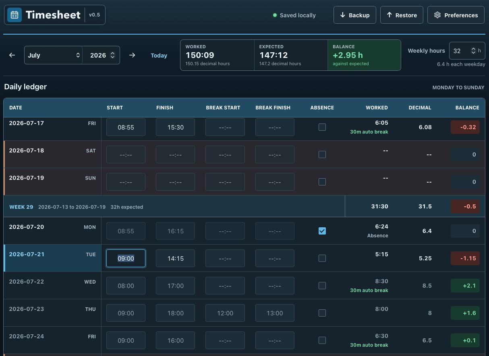

# Local Timesheet

A dependency-free monthly timesheet that runs entirely in the browser. No server, account, internet connection, or installation required.

## Use

Open `index.html` in a normal browser window. Keep using the same browser profile and file location so local data remains available.

- Enter one same-day work interval and an optional break per day. Common 24-hour inputs such as `9`, `0900`, and `09:00` normalize to `HH:MM`.
- Shifts of at least six hours deduct a minimum 30-minute break.
- Mark paid leave with **Absence**. The day receives its configured weekday target while saved time entries remain unchanged.
- Navigate or enter years from 1900 through 9999.

## Targets and balances

- The default target is 32 hours per week, distributed Monday-Friday. Weekends have no target.
- Each month keeps its own target after inheriting the previous effective value when first opened.
- Balances include dates due through today and completed future entries. Weekly totals run Monday-Sunday; monthly totals include only the selected month.

## Data and preferences

- Changes and calculations appear immediately. Rapid typing is saved to browser `localStorage` after a brief pause; pending edits are flushed when leaving a field, backgrounding the page, or navigating away.
- **Backup** downloads a JSON copy. **Restore** validates and merges a backup, replacing matching entries while preserving other local dates.
- Restore accepts files up to 10 MiB and rejects states above 50,000 daily entries or 2,400 monthly schedules before applying them.
- **Preferences** controls date format, language (English, German, Spanish, or French), and theme.
- On compact screens, app actions move into the hamburger menu.

## Tests

Open these pages directly in a browser:

- `tests/i18n.test.html`
- `tests/core.test.html`
- `tests/model.test.html`
- `tests/storage.test.html`
- `tests/app.test.html`

Each page displays its pass/fail result. The app suite uses an isolated storage key and covers the responsive UI, period boundaries, persistence failures, current and legacy backup restore, malformed and oversized imports, preferences, escaping, and date rollover.

## Architecture

The project uses classic deferred scripts so it can run directly from `file://` without a build step. Keep dependencies before their consumers in the order used by `index.html`:

1. `js/i18n.js` owns language metadata, calendars, and translation catalogs.
2. `js/themes.js` owns the theme registry.
3. `js/core.js` contains pure time, date, schedule, and summary calculations.
4. `js/model.js` owns the persisted state schema, normalization, and merging.
5. `js/storage.js` handles `localStorage` and backup envelopes.
6. `js/menu.js` dispatches responsive menu actions.
7. `js/preferences.js` renders and validates preference controls.
8. `js/ledger.js` renders the month and handles ledger input.
9. `js/app.js` composes the modules and coordinates persistence and restore.

Business rules and period constraints belong in `core.js`, persisted-data rules and collection limits in `model.js`, browser transport in `storage.js`, and DOM behavior in the relevant controller. `app.js` should remain the composition root rather than accumulating feature logic.

The application release is v0.5. Persisted state remains on `local-timesheet.state.v1` and schema version 1, so existing v0.4 data and backups remain compatible. Backups wrap the same state in a `local-timesheet-backup` envelope. Changes to required persisted fields must remain backward compatible or introduce an explicit schema migration.

## Extending

### Add a language

Add the same language ID to `LANGUAGE_METADATA`, `CALENDARS`, and `CATALOGS` in `js/i18n.js`. Supply every key from the English catalog; the language selector is populated automatically. Extend the i18n tests for catalog completeness and the app tests for switching behavior.

### Add a theme

Add an `{ id, labelKey }` descriptor to `js/themes.js`, add the label key to every translation catalog, and define its `html[data-theme="id"]` variables in `styles.css`. Add matching `data-preview="id"` styling when the theme needs a custom swatch. The preferences selector is populated automatically.

### Add a ledger field

Add a descriptor to `ENTRY_FIELD_DEFINITIONS` in `js/model.js`; headers, inputs, cloning, emptiness checks, and validation use that registry. Add its translation key to every catalog and update `calculateShift()` in `js/core.js` if the field changes worked-time semantics. Preserve existing version 1 entries by normalizing a missing field or add a migration before making it required. Cover the model, calculation, storage, and integrated rendering paths.

### Add a menu action

Add a button with `data-action="name"` to `#headerActions`, add its translated label, and register the matching handler in `initializeMenu()` in `js/app.js`. `js/menu.js` handles dispatch, closing, keyboard behavior, and responsive focus return without action-specific code.

### Add a preference

Add the default, cloning, and validation rules in `js/model.js`; add the control in `index.html`; wire it through `js/preferences.js`; and apply the change through a callback in `js/app.js`. Add translation keys and model/app coverage. Keep old states valid when introducing a required preference, or migrate the schema explicitly.