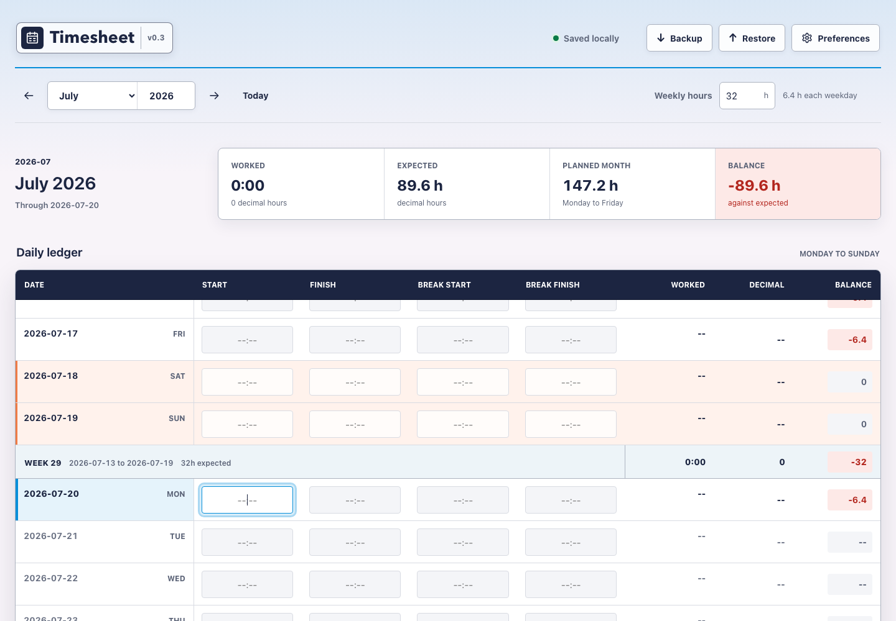

# Local Timesheet

A dependency-free monthly timesheet that runs entirely in the browser. No server, account, internet connection, or installation is required.

The current release is **Timesheet v0.3**.

## Open the timesheet

Open `index.html` in a normal, non-private browser window. For reliable persistence:

- Continue using the same browser profile.
- Keep this folder in the same location.
- Do not use a private or incognito window.

The current month opens automatically and today's Start field receives focus.

## Enter time

Time fields accept 24-hour values such as `9`, `900`, `09:00`, `1600`, and `16:00`. Valid values normalize to `HH:MM` when focus leaves the field.

Each day supports one same-day work interval and one optional break interval. Finish must be later than start, and an entered break must be fully inside the work interval.

For a gross shift of at least six hours, at least 30 minutes are deducted:

- No entered break: deduct 30 minutes.
- Entered break under 30 minutes: deduct 30 minutes.
- Entered break over 30 minutes: deduct the entered duration.

For example, `09:00` to `16:00` with no entered break produces `6:30` worked and `6.5` decimal hours.

## Targets and balances

The initial schedule is 32 hours per week, spread evenly across Monday to Friday. Weekends have a target of zero.

When a month is opened for the first time, it copies the previous effective monthly value. After that, changing either month does not change the other.

Balances include dates due through today and valid shifts entered ahead of time:

- Blank past weekdays count as missed target time.
- A valid future shift immediately counts toward its daily, weekly, and monthly totals and balances.
- Blank or incomplete future weekdays do not create a deficit yet.
- Historical months include the full month.
- Weekend work counts as positive time.

Weekly summaries cover complete Monday-Sunday weeks, including muted dates from adjacent months. The monthly summary only counts dates in the selected month.

## Saving and backups

Every edit is written immediately to browser `localStorage`. There is no app-defined expiry, but browser data can still be removed by browser cleanup, profile changes, storage policies, or moving/opening the page under a different file path.

Use **Backup** periodically to download a dated JSON file. **Restore** validates a selected backup, asks for confirmation, and merges it into local data:

- Imported values replace matching dates and monthly schedules.
- Backups created by v0.3 also restore display preferences.
- Older backups without preferences leave the current local preferences unchanged.
- Local dates absent from the backup are preserved.

There is intentionally no clear-all action.

## Preferences and display

Open **Preferences** from the gear button beside Restore. The Preferences dialog can be closed with its close button, by selecting the blurred backdrop, or with <kbd>Esc</kbd>.

The date format applies to ledger dates, weekly ranges, summary cutoff dates, and accessible time-field labels. Available formats are:

- `YYYY-MM-DD`
- `DD.MM.YYYY`
- `MM/DD/YYYY`
- `MM-DD`
- `MM/DD`
- `DD MMMM`, for example `20 July`

The selected format is saved immediately in `localStorage` and included in new backups. Internal calculation keys and backup filenames continue to use ISO dates regardless of the display setting.

Language and design selectors are visible as previews of planned preferences. English and the current gradient design remain fixed in v0.3.

At compact screen widths, save status, Backup, Restore, and Preferences move into the hamburger menu beside the Timesheet wordmark.

## Browser tests

The project includes browser-native tests because Node.js is not required or currently available on this laptop:

- `tests/core.test.html` covers time, break, calendar, target, and aggregate rules.
- `tests/storage.test.html` covers persistence, validation, preferences, schedule snapshots, and old/new backup merging.
- `tests/app.test.html` drives the real app in an isolated test-storage namespace and checks editing, preferences, reload persistence, navigation, summaries, validation, and desktop/phone layouts.

Opening the test pages in Chrome displays a pass/fail result. The app integration test uses a separate storage key and cannot overwrite the production timesheet data.