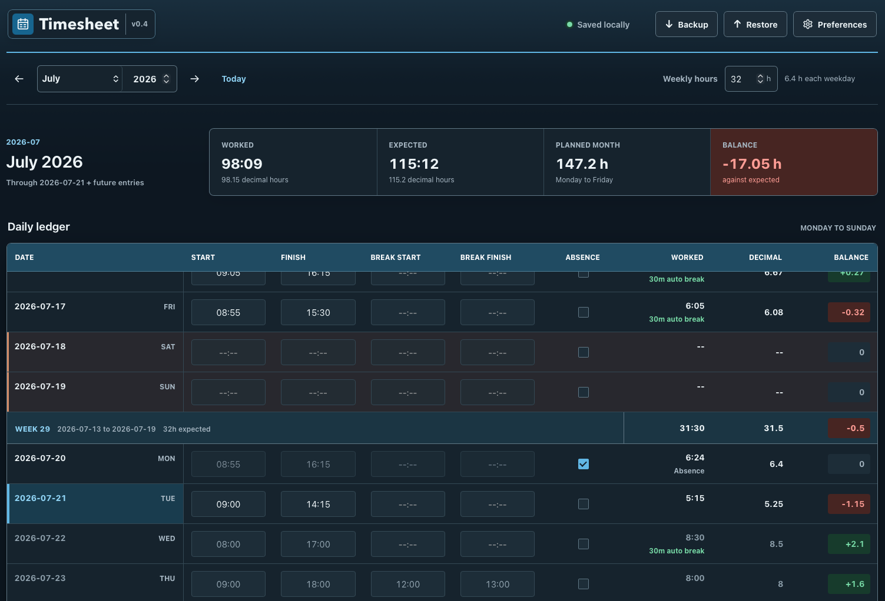

# Local Timesheet

A dependency-free monthly timesheet that runs entirely in the browser. No server, account, internet connection, or installation required.

## Use

Open `index.html` in a normal browser window. Keep using the same browser profile and file location so local data remains available.

- Enter one same-day work interval and an optional break per day. Common 24-hour inputs such as `9`, `0900`, and `09:00` normalize to `HH:MM`.
- Shifts of at least six hours deduct a minimum 30-minute break.
- Mark paid leave with **Absence**. The day receives its configured weekday target while saved time entries remain unchanged.

## Targets and balances

- The default target is 32 hours per week, distributed Monday-Friday. Weekends have no target.
- Each month keeps its own target after inheriting the previous effective value when first opened.
- Balances include dates due through today and completed future entries. Weekly totals run Monday-Sunday; monthly totals include only the selected month.

## Data and preferences

- Changes save immediately to browser `localStorage`.
- **Backup** downloads a JSON copy. **Restore** validates and merges a backup, replacing matching entries while preserving other local dates.
- **Preferences** controls date format, language (English, German, Spanish, or French), and design.
- On compact screens, app actions move into the hamburger menu.

## Tests

Open `tests/core.test.html`, `tests/storage.test.html`, `tests/i18n.test.html`, and `tests/app.test.html` in a browser. Each page displays its pass/fail result; app tests use isolated storage.